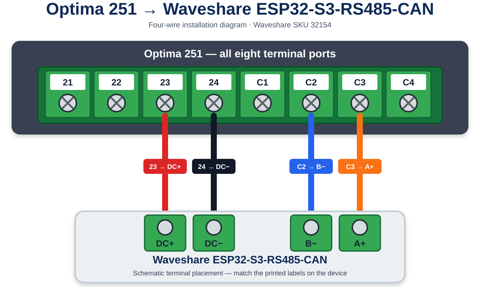

# ESPHome for NIBE GV-HR 120-400 / ALTO Basic 120-400

`smart-ventilation.yaml` replaces the ESP-IDF gateway with an ESPHome device
that connects directly to Home Assistant through its encrypted native API.
It includes all 15 semantic write operations in the current firmware. No
external component or MQTT broker is needed.

## Compatibility

This configuration was developed and tested with the following installation:

- **Ventilation unit:** NIBE GV-HR 120-400
- **Regional product name:** NIBE ALTO Basic 120-400
- **Controller:** Optima 251
- **Gateway:** [Waveshare ESP32-S3-RS485-CAN, SKU 32154](https://www.waveshare.com/esp32-s3-rs485-can.htm?sku=32154)

NIBE describes ALTO Basic 120-400 as the package containing the GV-HR 120-400
ventilation unit and EAH 21 electric air heater. The names are both included
here so owners can find the project under either product name. Compatibility
with NIBE ERS, other GV-HR models, other Optima controllers, or other board
revisions is not established by this test.

This is an independent community project and is not affiliated with or endorsed
by NIBE, Genvex, Waveshare, ESPHome, or Home Assistant.

Use **ESPHome 2026.8.2** for the initial build. The configuration uses that
release's Modbus API, including a small inline C++ lambda shared by the number
controls. Revalidate and compile when upgrading ESPHome.

## Hardware and connection

Defaults match the tested installation: GPIO17 TX, GPIO18 RX, GPIO21 RS-485
direction, Modbus slave 1, 9600 baud, 8 data bits, even parity, one stop bit.
Logging uses USB Serial/JTAG and does not occupy the Modbus UART.
The current running configuration uses ESP-IDF and the generic ESP32-S3 board
definition. The tested Waveshare board has 16 MB of flash, but this YAML does
not override the generic definition's build-time flash setting. PSRAM is not
required. Verify the hardware and build settings if using another revision.

The existing A/B wiring stays on the same board. If testing on another gateway,
disconnect the old Modbus master first. Only one master should drive this bus.

### Optima 251 wiring

Connect Optima 251 terminal **23** to the Waveshare **DC+** input and terminal
**24** to **DC−**. For Modbus RS-485, connect **C2** to **B−** and **C3** to
**A+**.



The diagram is schematic: follow the terminal markings rather than relying on
wire colors or the illustrated spacing. Disconnect power and verify voltage and
polarity before energizing the gateway.

## Setup

1. Download or clone this repository, then copy its YAML and secrets example
   into your ESPHome configuration directory, or build in the repository using
   the CLI. For a local build, install the pinned release in a virtual
   environment:

   ```sh
   python3 -m venv .venv
   . .venv/bin/activate
   pip install -r requirements.txt
   ```
2. Copy `secrets.example.yaml` to `secrets.yaml`. Enter your Wi-Fi credentials,
   the API encryption key used by Home Assistant, and a unique fallback-hotspot
   password. Generate a new 32-byte API key with `openssl rand -base64 32` for a
   new installation. The current running configuration does not set a separate
   OTA password. The example contains placeholders, not usable credentials.
   The real secrets file and build output are ignored by Git.
3. Validate and compile from the repository root:

   ```sh
   esphome config smart-ventilation.yaml
   esphome compile smart-ventilation.yaml
   ```

4. When ready to replace the running firmware, close any serial monitor and
   flash over USB:

   ```sh
   esphome upload smart-ventilation.yaml --device /dev/ttyACM0
   esphome logs smart-ventilation.yaml --device /dev/ttyACM0
   ```

5. Add the discovered device through Home Assistant's ESPHome integration and
   supply the API encryption key. If discovery is unavailable, add it by IP.

The first installation replaces any currently installed dashboard, HTTP API,
scanner and serial commands. Subsequent ESPHome updates can use OTA. Keep a
copy of any previous firmware and its configuration if you may need to restore
it over USB.
Creating this configuration does not flash the device.

## Read entities

All addresses are **decimal zero-based wire addresses**, not 30001/40001-style
reference numbers. FC04 and FC03 are separate address spaces.

| Entity | Function | Address | Conversion |
| --- | --- | ---: | --- |
| Supply air temperature | FC04 | 0 | `(raw - 300) / 10` °C |
| Outdoor air temperature | FC04 | 2 | same |
| Exhaust air temperature | FC04 | 3 | same |
| Extract air temperature | FC04 | 6 | same |
| Room temperature | FC04 | 9 | same |
| Humidity | FC04 | 10 | raw % |
| Supply fan output | FC04 | 102 | raw % |
| Extract fan output | FC04 | 103 | raw % |
| Bypass position (assumed) | FC04 | 104 | raw %, with observed 99 → 100 endpoint correction |
| Supply fan RPM (assumed) | FC04 | 108 | raw unsigned word, assumed rpm |
| Extract fan RPM (assumed) | FC04 | 109 | raw unsigned word, assumed rpm |
| Hygrostat | FC02 | 0 | bit 0 |
| Filter reset register (diagnostic) | FC03 | 105 | raw word |

Humidity follows the current `sv_profile.c` monitor mapping. Hygrostat is
supported by the supplied register documentation; commissioning against both
physical states remains pending. Bypass is included as an explicitly assumed,
read-only mapping from documented `3x0104`. On 2026-09-17 the user observed a
sensor reading of 99 while the controller display showed 100. The sensor now
maps raw 99 to 100%; all other in-range values, including 0, remain unchanged.
This is a provisional correction for that observed endpoint, not evidence of
a constant offset across the full range. Intermediate positions still need
comparison with the panel. Values outside 0–100 become unknown; readings
also expire after 90 seconds without a sample. Alarms and version candidates
remain excluded.

Supply/extract RPM use documented `3x0108`/`3x0109` as separate FC04 single-word
reads. Both returned zero in the 2026-09-14 live evidence, without a panel RPM
comparison. They are exposed as assumed RPM with no scaling or invented maximum;
the mapping and units still need correlation at different settled fan levels.
A returned zero is preserved, but does not establish that the fan is stopped.
Missing samples expire after 90 seconds. The existing supply/extract output
sensors at 102/103 are percentages and cannot be converted to measured RPM.

Every select/number below also reads its own holding register with FC03, so
panel changes appear in Home Assistant. Gateway connectivity and controller
response diagnostics are separate entities.

## Included write controls

All writes use **FC06, one register per command**. All listed entities are
included and enabled; service controls appear in Home Assistant's configuration
entity category.

| Entity | Address | Allowed values |
| --- | ---: | --- |
| Ventilation level selector | 100 | Off=0, Level 1–4=1–4 |
| Reset filter indicator button | 105 | fixed 1, once per press |
| Temperature setpoint | 0 | 10–30 °C, whole degrees |
| Supply fan level 1 / 2 / 3 | 6 / 7 / 8 | 0–100%, whole percent |
| Extract fan level 1 / 2 / 3 | 9 / 10 / 11 | 0–100%, whole percent |
| Controller clock hour | 200 | 0–23 |
| Controller clock minute | 201 | 0–59 |
| Controller clock weekday | 202 | 1–7 |
| Controller clock day of month | 203 | 1–31 |
| Controller clock month | 204 | 1–12 |
| Controller clock year | 205 | 0–99, added to 2000 |

The temperature setpoint uses a different encoding from the air sensors:
`raw = (°C - 10) * 10`, so 21 °C writes 110. Readback applies the inverse.

Clock fields are individually editable and show the controller's own values.
There is no automatic time synchronization or assumed weekday-name mapping:
the evidence establishes 1–7 but does not establish which value means Monday.
Year 26 means 2026. As in the current firmware, numeric limits do not validate
calendar combinations. Change one field at a time and check the panel; when
changing months, use a valid day for the destination month.

Filter reset and temperature setpoint remain labeled experimental in the
project documentation. Filter reset is included as requested; the register
may self-clear, so a return value of 0 does not prove failure. Check the panel
indicator before pressing it again. The button does not write a trailing 0.

Fan level settings are the supply/extract calibration values for levels 1–3,
not the live outputs and not the ventilation level selector. Record all six
original readings before editing. The ESPHome configuration does not reproduce
the dashboard's mandatory baseline capture step.

## Timing and command behavior

- Read cycles start every 30 seconds; configuration numbers and the filter
  diagnostic use `skip_updates: 1` (nominally every 60 seconds).
- `force_new_range: true` isolates each entity's register. Reads never span
  unverified gaps, and all register writes stay single-word.
- Requests have a 1000 ms response-start timeout and a 1000 ms turnaround
  delay. The bus queue serializes polling and user commands. Poll intervals
  are targets, not deadlines, especially during errors or a burst of edits.
- `max_cmd_retries: 0` applies to reads and writes. A lost write reply never
  causes an automatic write retry. Offline devices skip one update cycle.
- Numbers reject non-finite, fractional and out-of-range requests. Their shared
  write lambda bypasses ESPHome's usual immediate publication of the requested
  value. The selector also uses `optimistic: false`. State comes from subsequent
  scheduled FC03 polls, usually within 30–60 seconds plus queue delay.
- There is **no transactional readback verification/result** equivalent to the
  original command service. An unchanged displayed value can mean the next
  poll is pending or the write failed. Check readback and the panel before
  issuing another command. Filter diagnostic readback is likewise a scheduled
  observation, not proof that the indicator was reset.
- Numeric sensor readings expire to unknown after 90 seconds without a sample;
  the slower filter diagnostic expires after 180 seconds. Select, number and
  hygrostat entities retain their last reported state during bus faults. Check
  `Controller responding` as well; it detects device-level timeouts, not freshness
  of each register. A Modbus exception still counts as a device response.
- No startup, reconnect, time-sync or state-restoration automation writes to the
  ventilation controller. Explicit repeated user presses/commands remain
  separate requests. API disconnects do not trigger periodic reboots. The
  current YAML leaves Wi-Fi's reboot timeout at ESPHome's default and provides
  a password-protected fallback access point.
